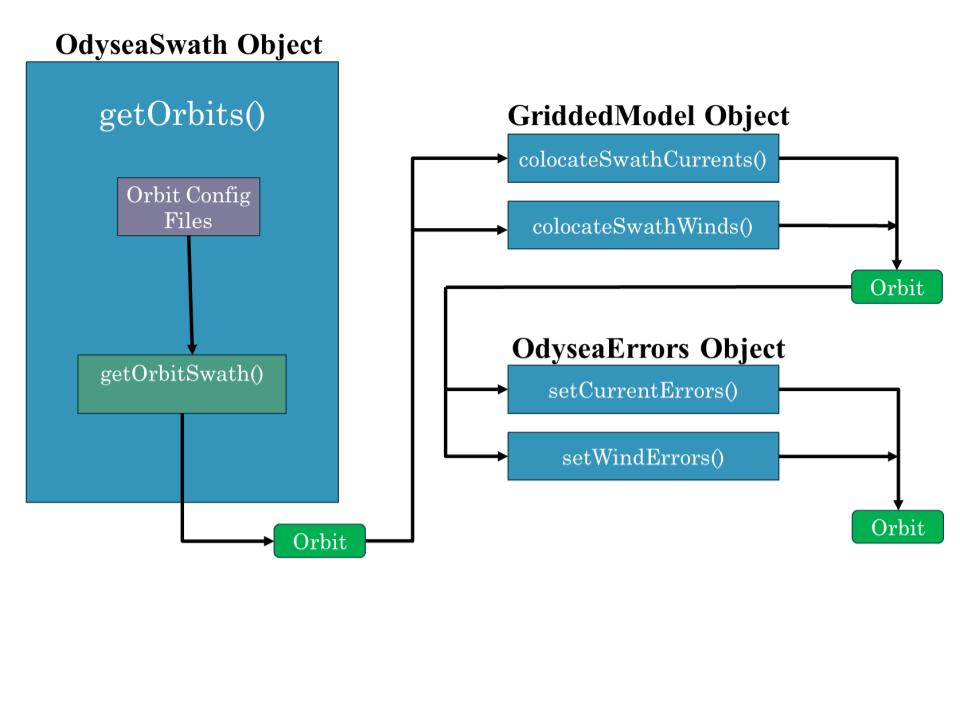
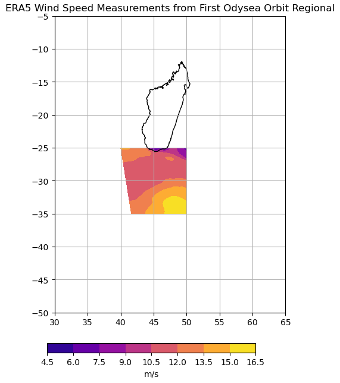

- Note: Written for the 2024-08-07 version of ODYSIM in regional_select branch

# ODYSEA Quick Start Guide
<details>
<summary> click to expand </summary>

### 1. Import ODYSIM Classes / Related Packages

```python
from odysim.swath_sampling import OdyseaSwath
from odysim.errors import OdyseaErrors
from odysim.colocate_model import GriddedModel

import numpy as np
import scipy
import xarray as xr
import datetime
import matplotlib.pyplot as plt
import cartopy.crs as ccrs
```

### 2. Create OdyseaSwath Object and Orbit Generator
- For a more thorough runthough of creating an orbit swath and a detailed description of the variables contained in the orbit dataset, see __"creating_odysea_orbital_swaths.ipynb"__ in the examples directory.

```python
odysea = OdyseaSwath()

start_time=datetime.datetime(2020, 1, 20, 0, 0, 0)
end_time=datetime.datetime(2022, 1, 20, 0, 0, 0)

orbit_generator = odysea.getOrbits(start_time, end_time)
```

### 3. Use the generator to create a specific orbit object

```python
orbit = next(orbit_generator)
```

### 4. Create a GriddedModel Object and Add Model Data to the Orbit
- __NOTE:__ Assumes data is saved as a list of netcdf files for each variable (u-current, v-current, u10m, v10m), with each set of files in a different sub-directory of a parent directory.
- For a more detailed description of how to colocate model data, see __"colocating_models_and_uncertainties_to_odysea_orbital_swaths.ipynb"__ in the examples directory.

```python
# Fill in variables with system paths
model = GriddedModel(model_folder='model_folder/', u_folder='U', v_folder='V', wind_x_folder='U10M', wind_y_folder='V10M')

orbit = model.colocateSwathWinds(orbit)
orbit = model.colocateSwathCurrents(orbit)
```

### 5. Create an OdyseaErrors Object and Add Uncertainties to the Orbit
- For a more detailed description of how to generate uncertainties and add them to the orbit dataset, see __"colocating_models_and_uncertainties_to_odysea_orbital_swaths.ipynb"__ in the examples directory.

```python
errors = OdyseaErrors()

orbit = errors.setWindErrors(orbit)
orbit = errors.setCurrentErrors(orbit, etype='simulated_baseline')
```
The orbit dataset now contains all location, data value, and uncertainty information needed. Sequential orbits can be generated by repeating steps 3-5. Note that the model and errors objects do not need to be re-created (and thus don't need to be called again when generating more orbits)

</details>

# ODYSEA Simulator Structure

The ODYSEA Simulator code is structured around the idea of adding information to an xarray dataset called "orbit", as shown in the figure below. This information is added by creating instances of different classes to represent the orbit trajectory, model data, and errors. This section of the tutorial will first go through the different classes and instance methods.



## Class: OdyseaSwath 
<details>
<summary> 
click to expand
</summary>

The OdyseaSwath class is used to create an object storing information about the orbit trajectory. Its instance methods are used to initially generate the orbit dataset with information about the lattitude, longitude, sample time, azimuth, and encoder angle of each point that will be sampled. 

### The `__init__()` Function
<details>
<summary> click to expand </summary>

The `__init__()` function in OdyseaSwath creates an object with the data for the orbit trajectory. It creates instance variables for the raw orbit trajectory which are accessed by later instance methods.

```python

def __init__(self,orbit_fname='orbit_out_2020_2023_height590km.npz',
config_fname='wacm_sampling_config.py',region=None):
```

The first and second arguments define the name of the orbit trajectory and swath sampling files, respectively. The final argument is an optional argument to define a specific region for the simulator to operate in. This trims the dataset to only lattitude/longitude points inside the region, which can speed up the execution and reduce file size. This function returns an instance of the OdyseaSwath class containing basic orbit path data.

</details>

### The `getOrbitSwath()` Function
<details>
<summary> click to expand </summary>

The `getOrbitSwath()` function processes the raw orbit trajectory data saved in the instance variables to create a dataset with latitude, longitude, and sample time variables for each point in the orbit. The dimensions of this dataset are the along track and across track coordinates of the sample point, relative to the trajectory of the satellite.

```python
def getOrbitSwath(self,orbit_x,orbit_y,orbit_z,orbit_time_stamp,orbit_s,write=False):
```

The arguments of this function are the raw coordinates of the ODYSEA orbit in ECEF coordinates _(numpy.ndarray)_. These are a subset of the full orbit trajectory contained in the instance variables of the OdyseaSwath object, and are often handled automatically by the `getOrbits()` function.

This function returns a dataset with dimensions of __'along_track'__ and __'cross_track'__ and variables __'sample_time'__, __'lat'__, __'lon'__, and __'swath_blanking'__. If the passed orbit trajectory does not intersect the region specified in the `__init__()` function, this function raises a `ValueError` with the message "orbit does not intersect selected region".

</details>

### The `setAzimuth()` Function
<details>
<summary> click to expand </summary>

The `setAzimuth()` function adds information on the azimuth, encoder angle, and bearing for each point in the orbit dataset.

```python
def setAzimuth(self,orbit):
```

This function takes as an argument a dataset with latitude and longitude as variables. It must thus be run after `getOrbitSwath()`. It returns a dataset with the added variables __'encoder_fore'__, __'encoder_aft'__, __'azimuth_fore'__, __'azimuth_aft'__, and __'bearing'__.

</details>

### The `getOrbits` Function
<details>
<summary> click to expand </summary>

The `getOrbits()` function acts as a wrapper around `getOrbitSwath()` and `setAzimuth()`, automating the process of generating an orbit dataset with all spacial variables loaded. It iterates through a loop, calling `getOrbitSwath()` and optionally `setAzimuth()`, yielding a generator object that can be used to create multiple sequential orbit datasets.

```python
def getOrbits(self,start_time,end_time,set_azimuth=True):
```

The arguments of this function are the start and end times for the orbit, and the optional argument set_azimuth. The 'start_time' variable _(datetime.datetime)_ defines the beginning of the first orbit that will be generated. 'end_time' _(datetime.datetime)_ defines the end of the last orbit that will be generated. 'set_azimuth' determines whether `setAzimuth()` is called. In most cases, this should be left as 'True', as the variables added are used in the error generation.

This object returns a generator object that can be called using `next(object)`. The output of this generator is a dataset with dimensions __'along_track'__ and __'cross_track'__ and all the variables added by `getOrbitSwath()` and (optionally) `setAzimuth()`.
- __NOTE:__ If `getOrbitSwath()` raises a `ValueError` specifically because the orbit does not intersect the region of interest, the generator will yield that error rather than break. Any code using both `getOrbits()` and the optional 'region' argument in `__init__()` should be prepared to handle the return of an error object from the generator.

</details>

</details>

## Class: GriddedModel
<details>
<summary> click to expand </summary>
The GriddedModel class is used to create an object storing information on the model that ODYSEA will be sampling. Its instance methods are used to simulate the satellite sampling the model and load that data into the orbit dataset.

### The `__init__()` Function
<details>
<summary> click to expand </summary>
The `__init__()` function reads model data from saved netcdf files and creates instance variables to store the model data.

```python
def __init__(self,model_folder='/u/bura-m0/hectorg/COAS/llc2160/HighRes/',u_folder='U',v_folder='V',
current_fname=None,wind_x_folder='oceTAUX',wind_y_folder='oceTAUY',
wind_fname=None,u_varname='U',v_varname='V',wind_x_varname='oceTAUX',
wind_y_varname='oceTAUY',variable_selector='winds+currents',
wind_var='speed',search_string = '/*.nc',preprocess=None,n_files=-1):
```

This function takes many different arguments, to enable reading of data stored in several different configurations. These arguments can be broadly broken up into two groups. Firstly, those which define the type of data to look for. Secondly, those which inform the program how the data is stored. 

#### Data Type Arguments
- 'variable_selector': Determines whether to look for wind data, current data, or both
    - To look for current data, include "current" in the string.
    - To look for wind data, include "wind" in the string.
    - To look for winds and currents, include both the "wind" and "current" substrings in the argument
- 'wind_var': Determines what units the wind data is in
    - If wind data is in the form of 'U10M' and 'V10M', set it equal to 'speed'.
    - If wind data is in the form of x and y wind stress, set it equal to 'stress'.
- 'preprocess': Function to apply to netcdf datasets before concatanating through `open_mfdataset()`
    - __NOTE:__ Not implemented for combined variable datasets.

#### Data Storage Arguments
The following is a list of which variables need to be defined to read various model configurations. Variables not mentioned do not need to be specified. In all instances, the netcdf files should store datasets with 'time', 'lat', and 'lon' as coordinates.
- Each variable stored as a list of netcdf files in a unique variable folder, unified under a general model folder:
    - 'model_folder' is the general folder containing the subdirectories for each variable folder.
    - 'u_folder', 'v_folder', 'wind_x_folder', and 'wind_y_folder' are the names of the subfolders containing u-current, v-current, u-wind, and v-wind data respectively.
    - 'u_varname', 'v_varname', 'wind_x_varname', and 'wind_y_varname' are the names of the variables in the datasets stored as netcdf files.
    - 'n_files' is the number of files to be read via open_mfdataset(). Leave as '-1' to open all files, or specify the number of files to read (can dramatically improve speed of computation to restrict the number of files to combine).
- Each variable stored as a single netcdf file in a unique variable folder, unified under a general model folder:
    - All as above, except set `n_files=1`
- Variables stored in a single netcdf file in a dataset with multiple variables:
    - 'n_files' should be set to the string "combined".
    - 'current_fname' is the name of the netcdf file containing a dataset with u-current and v-current data.
    - 'wind_fname' is the name of the netcdf file containing a dataset with u-wind and v-wind data.
        - __NOTE:__ 'current_fname' and 'wind_fname' may be the same if currents and winds are combined in a single dataset.
    - 'u_varname', 'v_varname', 'wind_x_varname', and 'wind_y_varname' are the names of the variables in the dataset(s).
- In all cases, use 'search_string' to inform the program what files to look for. This is used in a glob.glob() search of the model folder, and can filter files based on naming conventions.

The `__init__()` function returns an instance of the GriddedModel class containing the inputted model data.
</details>

### The `colocateSwathCurrents()` Function
<details>
<summary> click to expand </summary>

The `colocateSwathCurrents()` function interpolates gridded model current data onto the odysea swath grid and adds u-current and v-current velocities to the orbit dataset.

```python
def colocateSwathCurrents(self,orbit):
```

This function takes as an argument an orbit dataset. This dataset must have __'along_track'__ and __'cross_track'__ as dimensions, and __'sample_time'__, __'lat'__, and __'lon'__ as variables. `OdyseaSwath.getOrbit()` or `OdyseaSwath.getOrbitSwath()` will generate a dataset in the correct form.

This function returns the orbit dataset with the additional variables __'u_model'__ and __'v_model'__ as variables, both based on dimensions __'along_track'__ and __'cross_track'_.
</details>

### The `colocateSwathWinds()` Function
<details>
<summary> click to expand </summary>

The `colocateSwathWinds()` function interpolates gridded model wind data onto the odysea swath grid and adds wind variables to the orbit dataset.

```python
def colocateSwathWinds(self,orbit):
```

This function takes as an argument an orbit dataset. This dataset must have __'along_track'__ and __'cross_track'__ as dimensions, and __'sample_time'__, __'lat'__, and __'lon'__ as variables. `OdyseaSwath.getOrbit()` or `OdyseaSwath.getOrbitSwath()` will generate a dataset in the correct form.

This function returns the orbit dataset with additional wind variables based on what type of data was loaded during the initialization of the `GriddedModel` object. If wind speed data was provided (`wind_var='speed'`), the function adds __'u10_model'__, __'v10_model'__, __'wind_speed_model'__, and __'wind_dir_model'__ as variables. If wind stress data was provided (`wind_var='stress'`), the function also adds the variables __'tx_model'__ and __'ty_model'__. In all cases the variables are based on dimensions __'along_track'__ and __'cross_track'_.
- __NOTE:__ If wind stress data is provided, the variables __'u10_model'__, __'v10_model'__, __'wind_speed_model'__, and __'wind_dir_model'__ will be current relative values. If absolute wind speed is provided, the variables will also be absolute. This distinction is flagged with the 'Units' attribute in the case that variables are current relative.
</details>

</details>

## Class: OdyseaErrors
<details>
<summary> click to expand </summary>

The OdyseaErrors class is used to create an object storing information on how to generate uncertainties in ODYSEA measurements. Its instance methods generate random error fields for the wind and current measurements and add them to the orbit dataset.

### The `__init__()` Function
<details>
<summary> click to expand </summary>

The `__init__()` function reads data from an uncertainty table and uses it to construct an error interpolator based on wind speed, direction, and cross-track location.

```python
def __init__(self, lut_fn='../uncertainty_tables/odysea_sigma_vr_lut_height590km_look52deg_swath1672km.npz'):
```

This function takes as an argument the path to a .npz file containing information on uncertainties in ODYSEA's measurements. It returns an instance of the OdyseaErrors class containing an error interpolator.
</details>

### The `setWindErrors()` Function
<details>
<summary> click to expand </summary>

The `setWindErrors()` function assigns a random error value to each wind measurement and adds the resulting arrays as new variables to the orbit dataset.

```python
def setWindErrors(self,orbit,resolution=5000,etype='baseline'):
```

The first argument to the `setWindErrors()` function is an orbit dataset. This orbit dataset must contain wind variable data (specifically __'wind_speed_model'__ and __'wind_dir_model'__). Thus, `OdyseaErrors.colocateSwathWinds()` must be run before this function. The second argument, "resolution", allows for a scaling of the error based on the expected sampling resolution. By default, this is set to the expected resolution of ODYSEA, 5000m. Finally, "etype" is a string that scales the errors to explore different performance regimes. The options, in order of increasing uncertainty scaling, are "low", "baseline", and "threshold".

This function returns the orbit dataset with additional variables for the uncertainty in wind data. In all cases, it adds __'wind_speed_error'__, __'wind_dir_error'__, __'wind_u_error'__, and __'wind_v_error'__. If wind stress data is present in the input dataset, the variables __'stress_mag_error'__, __'stress_u_error'__, and __'stress_v_error'__ are also included. All variables are based on dimensions __'along_track'__ and __'cross_track'__.
</details>

### The `setCurrentErrors()` Function
<details>
<summary> click to expand </summary>

The `setCurrentErrors()` function assigns a random error value to each current measurement and adds the resulting arrays as new variables to the orbit dataset.

```python
def setCurrentErrors(self,orbit,resolution=5000,
etype='baseline',wind_speed=7,wind_dir=0):
```

The first argument passed to this function is an orbit dataset. This function also takes as arguments "resolution", "etype", and optionally wind_speed and wind_dir. Resolution, as above, functions as a scaling if investigating a sampling resolution other than ODYSEA's expected resolution of 5000m.

The "etype" argument sets the performance regime being investigated. The options for this string, in order of decreasing accuracy, are "low", "baseline", and "threshold". Additionally, the "etype" argument can be set to "simulated_baseline". In this case, the current errors are determined taking the wind speed and direction into account. Ideally, if __'wind_speed_model'__ and __'wind_dir_model'__ are present in the input dataset, the unique wind speed and direction at each sample point will be used to compute an uncertainty. If these variables are not present in the orbit dataset, the function will use the arguments "wind_speed" and "wind_dir" to generate a uniform uncertainty for every point based on a lookup table. It is thus preferred to run `colocateSwathWinds()` before `setCurrentErrors()`
- __NOTE:__ The "simulated_baseline" option for etype also requires __'encoder_fore'__, __'encoder_aft'__, __'azimuth_fore'__, and __'azimuth_aft'__ as variables in the orbit dataset. Thus, `set_azimuth` must be True when running `OdyseaSwath.getOrbits()` if "simulated_baseline" is going to be used.

This function returns the orbit dataset with the additional variables __'u_error'__ and __'v_error'__ added (both based on dimensions __'along_track'__ and __'cross_track'__). If the "simulated_baseline" option is used, several additional variables are loaded into the orbit dataset during calculation. These include __'vr_std_fore'__, __'vr_std_aft'__, __'vx_std'__, __'vy_std'__, __'u_std'__, and __'v_std'__.
</details>

</details>

# Examples
<details>
<summary> click to expand </summary>

## Reading Model Data
In addition to its flexibility in working with wind speed or wind stress and currents and/or winds, the ODYSIM code can process several different data storage formats. The following examples demonstrate how to use `GriddedModel.__init__()` to read different file configurations

### Subdirectories for each variable + Individual timestamp files for each variable
<details>
<summary> click to expand </summary>
This example demonstrates how to configure `GriddedModel.__init__()` to read a file structure with data for each variable saved to a different subdirectory, with a separate file for each timestamp, as shown below.


```python
model = colocate_model.GriddedModel(model_folder='/home/shared/data/c1440_llc2160/CCS/time_indexed_files/', u_folder='U', v_folder='V', wind_x_folder='U10M', wind_y_folder='V10M', u_varname='U', v_varname='V', wind_x_varname='U10M', wind_y_varname='V10M', n_files=240)
```

This code instructs the simulator that there are 4 relavant subdirectories of the `model_folder` path, each of which contains data for a different variable. These are specified by the `_folder` arguments. The code concatanates the first 240 netcdf files (defined by `n_files`) into a single xarray dataset for each subdirectory. The `_varname` arguments inform the code what variable to pull out of the concatanated datasets.
- __NOTE:__ This function call uses the default settings of the `variable_selector`, `wind_var`, and `search_string` arguments to read all files that end in ".nc" and load both current and wind speed data.
</details>

### Subdirectories for each variable + Combined file for each variable
<details>
<summary> click to expand </summary>
This example demonstrates how to configure `GriddedModel.__init__()` to read a file structure with data for each variable saved to a different subdirectory, with a single netcdf file containing all timestamps for the variable, as shown below.


```python
model = colocate_model.GriddedModel(model_folder='/home/shared/data/c1440_llc2160/CCS/time_indexed_files/', variable_selector='wind',wind_var='stress',wind_x_folder='taux',wind_y_folder='tauy', wind_x_varname='tau_x',wind_y_varname='tau_y',n_files=1)
```
- __NOTE:__ This example code uses only wind stress data, thus only 2 variables are present, instead of 4.

This code instructs the simulator that within the path defined by `model_folder` there are relavant subdirectories specified by `wind_x_folder` and `wind_y_folder`. Note 'that since `variable_selector = 'wind'` current data is not processed, and since `wind_var = 'stress'` wind data is read as stress instead of speed. The argument `n_files` specifies that there is only a single file to read, which contains wind stress data for the entire time period of interest. As before, the `_varname` arguments specify what variable to look for inside the xarray dataset.

-__NOTE:__ The code will function for any value of `n_files` greater than or equal to the number of files to be read. This can be useful if, for example, wind data is concatanated to a single file while current data is saved as a list of netcdf files.
</details>

### Common directory + Single file for all winds and single file for all currents
<details>
<summary> click to expand </summary>
This example demonstrates how to configure `GriddedModel.__init__()` to read a file structure with a single model folder containing one dataset for winds and another for currents, as shown in the figure below.


```python
model = colocate_model.GriddedModel(model_folder='/home/shared/data/c1440_llc2160/CCS/time_indexed_files/combined_test/', current_fname='coupled_currents.nc', u_varname='U', v_varname='V', wind_fname='coupled_winds.nc', wind_x_varname='U10M',wind_y_varname='V10M', n_files='combined')
```

This example function call utilizes the `n_files = 'combined'` argument assignment to signal to the code that winds and currents are saved as combined datasets with both x and y components as variables. In this configuration, one calls `current_fname` and `wind_fname` instead of the `_folder` arguments to direct the code to look for individual files specified by the value passed as the argument instead of subdirectories. The `_varname` arguments still specify the names of the relavant variables in the xarray datasets.
</details>

### Common directory + Single file for all variables
<details>
<summary> click to expand </summary>
This example demonstrates how to configure `GriddedModel.__init__()` to read a file structure with a single model folder containing one dataset for winds and another for currents, as shown in the figurfor all variables (wind and current in the x and y directions). Note that this functions very similarly to the "Common directory + Single file for all winds and single" example.


```python
model = colocate_model.GriddedModel(model_folder='/home/shared/data/c1440_llc2160/CCS/time_indexed_files/combined_test/', current_fname='coupled_vars.nc', u_varname='U', v_varname='V',wind_fname='coupled_vars.nc',wind_x_varname='U10M', wind_y_varname='V10M',n_files='combined')
```

This example function call utilizes the `n_files = 'combined'` argument assignment to signal to the code that winds and currents are saved as combined datasets with both x and y components as variables. In this configuration, one calls `current_fname` and `wind_fname` instead of the `_folder` arguments to direct the code to look for individual files specified by the value passed as the argument instead of subdirectories. This example differs from the above one in that `current_fname` and `wind_fname` point to the same file, which contains all the necessary data. The `_varname` arguments are used to pull out the correct variables from the xarray dataset.
</details>

## Running a Regional Simulation
<details>
<summary> click to expand </summary>

Using the regionalization option when running ODYSIM will allow for faster processing and reduced file size when one is interested in a specific area and not the entire swath. This can be particularly useful when simulating many orbits, as the regionalization code quickly flags orbits that do not intersect the region of interest. This can be used to skip unnecessary processing on unused orbits.

The following uses ERA5 wind speed data to generate a the part of the swath intersecting the south coast of Madagascar.

1. Create an OdyseaSwath object, specifying the bounds of the region of interest in the form of a list of [lon_min, lon_max, lat_min, lat_max]. 

```python
swath = swath_sampling.OdyseaSwath(region=[40, 50, -35, -25])
```

2. Select a start and end time and create an orbit generator object using `OdyseaSwath.getOrbits()`.

```python
start_time=datetime.datetime(2020, 1, 20, 0, 0, 0)
end_time=datetime.datetime(2022, 1, 20, 0, 0, 0)
orbit_generator = swath.getOrbits(start_time=start_time, end_time=end_time)
```

3. Create GriddedModel and OdyseaErrors objects using desired arguments to control model loading, data variables, and error types.

```python
ody_model = colocate_model.GriddedModel(model_folder='/home/shared/data/FORCING/ERA5/', wind_fname='wind_2020.nc', wind_x_varname='u10', wind_y_varname='v10', variable_selector='wind', n_files='combined')

odyerrors = errors.OdyseaErrors('/home/jclemson/odysea-science-simulator/odysim/uncertainty_tables/odysea_sigma_vr_lut_height590km_look52deg_swath1672km.npz')
```

4. Create an orbit using `next(orbit_generator)` and add model data and errors to it using the appropriate class functions of GriddedModel and OdyseaErrors. This example uses only wind speeds.

```python
orbit = next(orbit_generator)
orbit = ody_model.colocateSwathWinds(orbit)
orbit = odyerrors.setWindErrors(orbit)
```

The orbit dataset now contains data for all variables solely in the intersection between the specified region and the orbit swath. For this example, the plot below is produced.


</details>

</details>